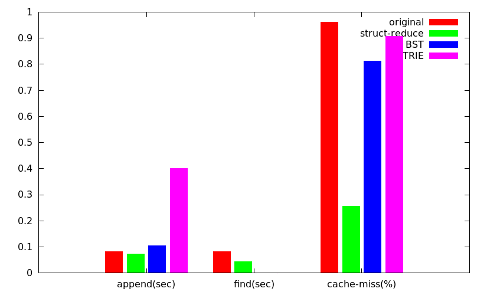

# phonebook

The program's goal is to search the specific lastname from dictonary words.
I use three different method to compare from original.
They are **reduce struct**, **BST**, **TRIE** saperately.

# AStyle

You can use AStyle ([Artistic Style](http://astyle.sourceforge.net/)) source code indenter to
help you auto format your source code. It will for sure not correct all your coding styles but
for sure will eliminate most of them. You can download AStyle from [this location](http://astyle.sourceforge.net/)
or install via `apt-get`:
```sh
sudo apt-get install astyle
```

To format your file you can execute below command:
```sh
astyle --style=kr --indent=spaces=4 --indent-switches --suffix=none *.[ch]
```

Install Git pre-commit hook to check C/C++ source file format
```sh
ln -sf ../../scripts/pre-commit.hook .git/hooks/pre-commit
```

# makefile

You can use `make perf` to analyze phonebook_orig's efficiency and cache as default.
If you want to analyze other files, use `make perf GOAL='file_name'`. For example, using `make perf GOAL=./phonebook_bst` to analyze bst method.

# histogram

After analyzing, I arrange the output data like the format
```txt
name			original	struct-reduce	BST			TRIE
append(sec)		0.081764	0.072458		0.104955	0.400078
find(sec)		0.081764	0.043213		0.000004	0.000001
cache-miss(%)	0.96204		0.25672			0.81183		0.90833
```

Use `gnuplot` script to plot the [histogram](histogram.png)
```sh
gnuplot
> set yrange[0,1]
> set style data histogram
> set style fill solid
> set style histogram gap 1
> set boxwidth 0.8
> set key autotitle columhead
> set title "phonebook comparison"
> plot for [COL=2:5] 'histogram.dat' using COL:xticlabels(1) title column
> set output "histogram.png" ; set term pngcairo size 825,500 enhanced font "Verdano,  12" ; replot
```
Here is the result of my example.

